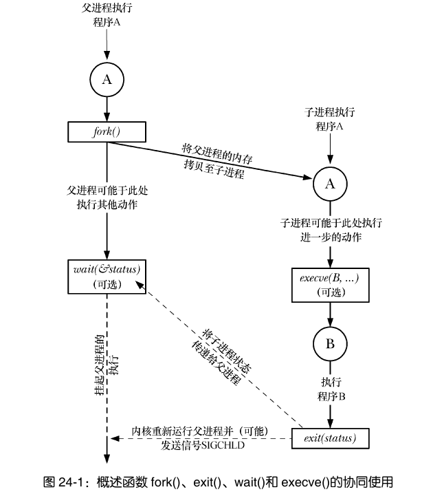
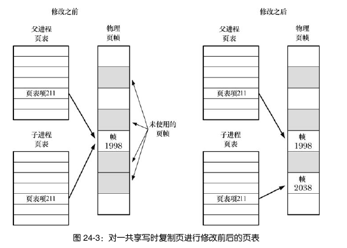

# 第24章 进程的创建

### 24.1 fork()、exit()、wait()以及 execve()的简介

- fork()创建一个和原来几乎一模一样的子进程，获得和父进程相同的栈、数据段、堆和文本段的拷贝。
- exit(&status)终止进程，它在_exit()的上层。它把进程所占用的所有资源（内存、文件描述符等）归还内核，交其进行重新分配。参数status为一整型变量，表示进程的退出状态，可由父进程通过wait()获取。
- wait(&status)，等待子进程的终止，接收终止的子进程的状态。
- execve(pathname,argv,envp)，加载一个新程序（路径名pathname,参数列表argv,环境envp）。它会丢弃现存程序文本段，为新程序重新创建栈、堆、数据段，开始新程序。

*下面是一个相互协作的示例：*




### 24.2 创建新进程：fork()

fork()创建一个子进程，文本段完全相同，数据段、栈和堆则另外独立地复制一份。

```cpp
#include <unistd>
pid_t fork(void);   /*In parent:returns process ID of child on success,or -1 on error;
		 			  In successfully created child:always returns 0
```

创建失败的原因可能是达到了系统对此真实用户设置的上限(RLIMIT_NPROC)，也可能是突破了系统创建的最大进程数这一系统级上限。

fork()之后每个进程都会从fork()的返回处继续执行。注意，调用fork()之后，系统先垂青哪个进程是不确定的（当然你可以对其进行人为干扰，比如wait()一下）


#### 24.2.1 父子进程间的文件共享

子进程会拥有父进程所有文件描述符的副本。这意味着父、子进程的文件描述符均指向相同的文件描述句柄。

如果父/子进程改变了文件某些属性，那么这个改动在子/父进程通过相应的文件描述符也是可见的。

#### 24.2.2 fork() 的内存语义

在一些早期的UNIX实现中，fork()保持自身内存不变，老老实实地把内存复制一份到交换空间，然后再将之从交换空间载入内存作为子进程。

这样很浪费，因为fork()之后经常伴随 exit() ，这会用新程序替换进程的代码段。并且初始化堆、栈、数据段，等于刚刚白复制了一遍

现在采用两种技术避免这种浪费：

- 系统调用fork()为子进程创建代码段时，其所构建的页表指向与父进程相同的物理内存页帧。从而父子进程可以共享同一代码段。
- 对于父进程数据段、栈段和堆段中的各页，采用写时复制技术：fork()后，内核捕获父进程或子进程发出的更改这些页面的请求，为要修改的地方新创建一份拷贝，然后把该拷贝分配给遭到捕获的进程（就是刚刚在提要求的进程，遭捕获是说它的声音被内核听见了），还会对子进程的相应页表项做相应调整。



##### 控制进程的内存需求

进程可能会因为杂七杂八的事情，比如说调用函数、malloc()和free() 等等，改变对内存的需求。

利用这项技术，把任务分配给子进程处理，可以保证父进程的内存不变。

基于此：

- 若已知某个函数会内存泄露或堆过度碎片化，但我们无法访问它的源码，该技术可以避免这个问题。
- 做树形分析时，省去了free()


### 24.3 系统调用 vfork()

已过时，尽量不使用。

两个特性：

- 子进程共享父进程的内存
- 在子进程调用 exec() 或 _exit() 之前，将暂停执行父进程


### 24.4 fork() 之后的竞争条件

调用 fork() 后可，无法确定父、子进程间谁将率先访问 CPU（在多处理器系统中，它们可能会同时各自访问一个 CPU)。我们不应对fork() 之后父、子进程的特定顺序做任何假设。

若确需保证某一特定执行顺序，则必须采用某种同步技术。

