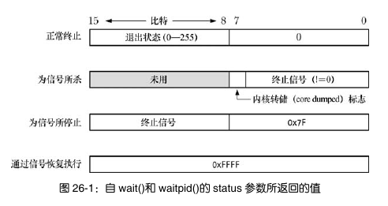

# 第26章 监控子进程

## 26.1等待子进程

#### 26.1.1 系统调用 wait()

 wait() 等待任一子进程结束，同时在参数status所指向的缓冲区中返回该子进程的状态。

```c
#include <sys/wait.h>
pid_t wait(int *status);  //Returns process ID of terminated child, or -1 on error
```

1. 一直阻塞，直到有个子进程终止了。如果调用时已有子进程终止，wait() 则立即返回。
2. 如果 status 不为空，就接收子进程的状态值。
3. 内核将该子进程的进程时间追加到父进程的所有子进程的运行总量中，资源使用数据也是一样。
4. 将终止子进程的 ID 作为 wait()的结果返回。

出错时，wait()会返回-1,并且将errno置为ECHILD。于是，我们可以用下面的方法等待所有进程返回。

```c
while (childPid = wait(NULL) != -1)
    continue;
if (errno != ECHILD)
    errExit("wait");
```


#### 26.1.2 系统调用 waitpid()

系统调用 wait()存在诸多限制,而设计 waitpid()则意在突破这些限制。

- 如果父进程已经创建了多个子进程,使用 wait()将无法等待某个特定子进程的完成,只能按顺序等待下一个子进程的终止。
- 如果没有子进程退出,wait()总是保持阻塞。有时候会希望执行非阻塞的等待:是否有子进程退出,立判可知。
- 使用 wait()只能发现那些已经终止的子进程。对于子进程因某个信号(如 SIGSTOP 或SIG TTIN)而停止,或是已停止子进程收到 SIGCONT 信号后恢复执行的情况就无能为力了。

```c
#include <sys/wait.h>
pid_t waitpid(pid_t pid,int *status,int options);  //Returns process ID of child ,0(see text),or -1 on error
```

参数 pid 用来表示需要等待的具体子进程,意义如下:

-  如果 pid 大于 0,表示等待进程 ID 为 pid 的子进程。
-  如果 pid 等于 0,则等待与调用进程(父进程)同一个进程组(process group)的所有子进程。34.2 节将描述进程组的概念。
-  如果 pid 小于-1,则会等待进程组标识符与 pid 绝对值相等的所有子进程。
-  如果 pid 等于-1,则等待任意子进程。wait(&status)的调用与 waitpid(-1, &status, 0)等价。

option是一个位掩码：

**WUNTRACED**

​		除了正常终止的子进程之外，如果子进程被信号停止也返回

**WCONTINUED**

		返回那些因收到 SIGCONT 信号而恢复执行的已停止子进程的状态信息。

**WNOHANG**

​		如果指定子进程状态没有改变就会立即返回，而不阻塞，返回0。如果没有与pid 匹配的子进程，则将errno 置为 ECHILD。


#### 26.1.3 等待状态值

由wait()或waitpid()返回的状态值有下面几种含义：

- 子进程调用 exit() 或 _exit() 终止，并指定一个整型值作为退出状态
- 被信号杀死
- 子进程因信号而停止，并以 WUNTRACED 标志调用 waitpid()
- 被停止的子进程收到SIGCONT恢复工作，并以 WCONTINUED 标志调用 waitpid()

这些都叫做”等待状态“，其中前面两个被称为“终止状态”。

事实上，虽然状态值是一个整型，但它基本上只有低两位字节会用到。



有几个宏（定义在<sys/wait.h>）可以对其进行进一步分析：

WIFEXITED (status) 

​		若子进程正常结束则返回真(true)。此时，宏 WEXITSTATUS(status) 返回子进程的退出状态。需要注意的是，在父进程中只关注子进程退出状态的最低 8 位，这一点在 25.1 节有详细的介绍。

WIFSIGNALED (status) 

​		若通过信号杀掉子进程则返回真(true)。此时，宏 WTERMSIG(status) 返回导致子进程终止的信号编号。如果子进程产生了内核转储文WCOREDUMP(statu)返回真值(true)。需要注意的是，SUSv3 并未规范宏 WCOREDUMP()，不过大部分 UNIX 实现均支持该宏。

WIFSTOPPED (status) 

​		若子进程因信号而停止，则此宏返回为真值(true)。此时，宏 WSTOPSIG(status) 返回导致子进程停止的信号编号。

WIFCONTINUED (status) 

​		若子进程收到 SIGCONT 信号而恢复执行，则此宏返回真值(true)。自 Linux 2.6.10 之后开始支持该宏。


