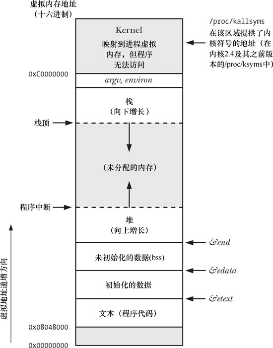

# 六 进程

### 6.1 进程和程序

进程是正在运行的程序，多个进程可以由同一个程序创建而来

程序包含了 能描述如何在运行时创建一个进程 的信息

其中内容包括：

- 二进制格式标识：自身文件格式的元信息，内核用它来解读程序中的其他内容。
- 数据：程序文件中包含的变量初始值以及程序使用的字面常量的值
- 程序入口地址：标识程序开始执行的起始指令位置
- 要链接的东西：程序运行时需要使用的共享库


从内核的角度来看，进程是用来分配资源的一个抽象的实体。进程由用户内存空间以及一系列内核数据结构组成。用户内存空间包含了用户设计的程序代码以及在程序中设定的变量值；内核的数据结构则用于维护进程状态信息，比如虚拟内存表、打开的文件描述表、与进程相关的标识号。


### 6.2 进程号与父进程号

每个进程都有一个独一无二的进程号，它是一个正数。

Linux有一个最大进程号，如果超过了进程号计数器将重置，从较小整数开始分配（这个“较小”的比较大，比如300这样不是从0开始）。这个最大进程号可以更改（/proc/sys/kernal/pid_max)。

```c
#include <unistd.h>
pid_t getpid(void)   //返回自身的进程号
```

```c
#include <unistd.h>
pid getppid(void)    //返回父进程的进程号
```

Linux系统特有的/proc/PID/status文件提供的PPid字段，可以获知所有进程的父进程


### 6.3 进程内存布局

进程中包含不同的段

- 文本段：程序运行时的机器代码语言指令，为了防止意外篡改，所以具有只读属性。同时为了给多个程序共享，可映射到多个进程中的虚拟内存。
- 初始化数据段（用户初始化数据段）：包含被初始化的全局变量和静态变量
- 未初始化数据段（零初始化数据段）：又被叫做BSS段。包含未被初始化的全局变量和静态变量。程序在磁盘中存储时不用为它分配空间，只需要记录这些变量的位置及大小，因为它们会在程序启动之前被系统自动分配为0。
- 栈：由栈帧组成，系统会给每一个调用的函数分配一个栈帧。栈帧中有函数的局部变量、实参和返回值
- 堆：程序员自己动态分配，堆顶端称为 program break

函数更改初始化数据段和未初始化数据段可能会出现问题，这涉及到函数的可重入问题。




上图中灰色的部分没有分配页表，这些范围在进程虚拟地址空间中不可用。


### 6.4 虚拟内存管理

将每个程序使用的内存切割成小型的、固定大小的页。相应地，RAM被划分为尺寸相同的页帧。

每个进程都会有自己的页表，并由内核维护管理，通过页表把虚拟内存转化为对应的物理内存

对于一个正在运行的程序来说，不是所有虚拟地址在物理内存中都有对应的页。

部分驻留在物理内存页帧的页被称为驻留集


虚拟内存的实现依赖于访问局部性

**访问局部性**

1. 时间局部性：倾向于运行刚刚运行的指令（比如循环中一段代码循环执行）
2. 空间局部性：倾向于访问刚刚访问的内存附近的内存（比如顺序访问数组或其他的数据结构）

由于访问局部性，所以即使只有部分页存在于驻留集中，下次访问依然有可能成功。


如果内存想要访问的虚拟内存通过页表映射的实际物理地址不存在，那么就会发生页面错误（Page Fault）

[图解|什么是缺页错误Page Fault - 简书 (jianshu.com)](https://www.jianshu.com/p/c7b4ea025d4c)

**虚拟内存的好处**

- 不同的进程、进程与内核相互隔离
- RAM中可以同时容纳的进程增多
- 程序员在编程时不用关注程序在RAM中的物理布局
- 便于实现内存保护机制，可以标记页表，对其权限进行设置（可读、可写），以此作为安全限制
- 多个程序共享同一内存（页表指向同一块物理内存）


### 6.5 栈和栈帧

本处讨论的是用户栈，与内核栈区分开来。内核栈是每个进程保留在内核内存中的内存区域，在执行系统调用时，在受保护的内存中执行内部的函数调用。

栈随着函数的调用和返回线性地增长和收缩。X86-32架构之上的Linux,栈驻留在内存的高端，并从上向下增长。

专用寄存器——栈指针会记录当前栈顶的位置，每次调用函数就在栈上新分配一帧；函数返回时，将分配的帧从栈上移去。

栈中包含

- 函数实参和局部变量
- 调用的链接信息：一些CPU寄存器，比如程序计数器：记录下一条机器指令。调用其他函数时，会在被调用函数的栈帧中保存这些寄存器的副本，以便返回后可以知道原来运行的位置。


### 6.6 命令行参数（argc，argv）

每个C语言函数都必须有程序的入口——main()。当执行程序时，命令行参数由shell解析后提供argc和argv给main()，如果其他函数需要就必须当参数传入或者设置一个全局变量指向argv数组。

每个argv都是以'\0'结尾的字符串，最后一个argv是NULL。

argv[0]代表了程序自己的名字，它有一个妙用：给一个可执行程序创建不同的链接（即名字不同），然后再让程序查看argv[0]，根据链接的名字执行不同的操作。

argv和environ数组驻留在在内存中一块连续的区域。此区域可存储的字节数有上限要求。


### 6.7 环境列表

每个进程都有一个被称为环境列表的字符串数组，通过Linux专有的/proc/PID/environ文件可以查看。

环境列表是环境变量的集合，环境变量的形式为 XX=XXX，就像argv数组一样，环境列表的最后一项指向NULL。环境列表中的环境变量的排序是无序的。

在子进程创建时，父进程将环境传递给它，这是一种有效的进程间的沟通方式。而在这之后，父子之间各自环境的变化都相互不可见，彼此井水不犯河水。


在C语言中，有两种办法可以获取环境变量：

1.使用全局变量`char **environ` ，在程序里加上`extern char **environ`将其引入。

2.也可以在main()函数里像argc，argv作为一个参数传入：`int main(int argc,char* argv[],char* envp[])`。不过这种方法不在SUSv3的规范之列，最好避免使用。

#### 得到环境

```c
#include <stdlib>
char* getenv(const char* name);  //Return pointer to(value)string,or NULL if no such variable
```
*注意事项*

- getenv返回的字符串可能放置在静态分配的缓冲区，后续对getenv()、setenv()、putenv()或者unsetenv()的调用所以可能改写这块地方。为了以防万一，最好在调用setenv和putenv前，先把得到的字符串复制到一块自己准备的其他位置。
- SUSv3规定应用程序此函数返回的字符串，因为它是环境变量的一部分（name=value中的value）。要改环境变量就用专业的setenv和putenv。

#### 修改环境

```c
#include <stdlib.h>
int putenv(char* string);   //Returns 0 on success,or nonzero on error
```

参数string指向 name=value 形式的字符串。

putenv将会把环境列表中的一个指针指向与参数string所指向位置一致的地方，这意味着后续对参数string所指向的内容的修改会改变环境。出于这一原因，不应把string参数设定为自动变量。

```c
#include <stdlib.h>
int setenv(const char* name,const char* value,int overwrite);  //Returns 0 on success ,or -1 or error
```

要注意使用这个函数时不用加 ‘=’ (事实上，是绝对不要)。

这个函数会自己分配一块内存缓冲区，然后将name和value复制到那里，以此来创建一个新的环境变量。这意味着如果后续改变name和value所指的字符串，对环境不会有任何影响。

如果要添加的环境变量原来就有，那么，如果overwrite=0，就不会覆盖；如果overwrite=1，就会覆盖原来的环境变量。


unsetenv()函数从环境中移除一个指定name的环境变量

```c
#include <stdlib.h>
int unsetenv(const char* name)  //Returns 0 on success,or -1 on error
```

这个函数跟setenv()一样，参数中也不用画蛇添足地去加一个 '='。

如果要清空自身环境，可以通过environ变量获得所有环境变量的名称，然后逐一调用unsetenv()去移除每一个环境变量。


### 6.8 执行非局部跳转：setjmp() 和 longjmp()

```c
#include <setjmp.h>
int setjmp(jmp_buf env);  //Returns 0 on initial call,nonzero on return via longjmp()

void longjmp(jmp_buf env,int val);
```

setjmp为longjmp调用执行的跳转确立了跳转目标，即程序发起setjmp()调用的位置。第二次调用longjmp看上去跟第一次setjmp没什么两样，只不过setjmp()返回的值从 0 更改为了longjmp()指定的 val。

setjmp()把当前进程环境的各种信息保存到env参数中，这些信息包括但不限于程序计数寄存器和栈指针寄存器的副本。env常常作为全局变量，有时也当做函数入参传递，但这种用法很少见。

事实上，longjmp执行的是伪跳转，它的实现基于以下两点：

1. 剥离发起longjmp()调用的函数和setjmp()之间的所有栈帧（解开栈）。通过将栈指针寄存器重置为env参数内的保存值来实现。
2. 重置env中的程序计数器，回到原来的位置继续执行。

*用法实例*

```c
static void f1(void)
{
    longjmp(env,1);
}

switch(setjmp(env)){
    case 0:
        printf("initial setjmp()");
        f1();
        break;
    case 1:
        printf("jumped back from f1()");
        break;
}
```

