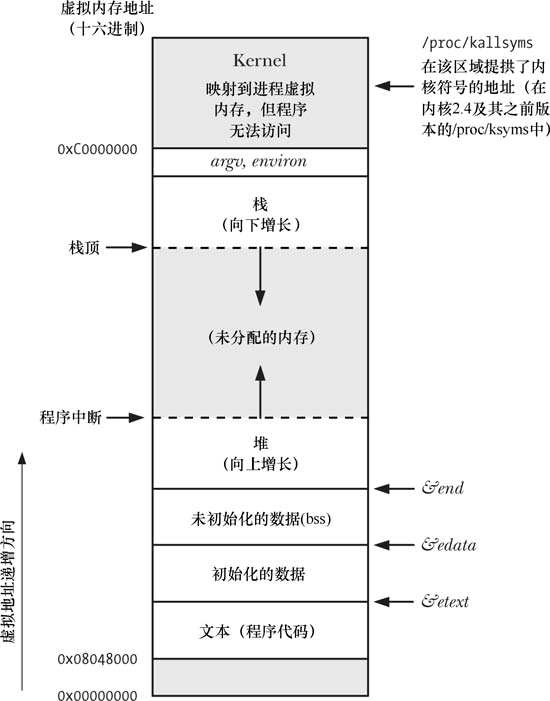
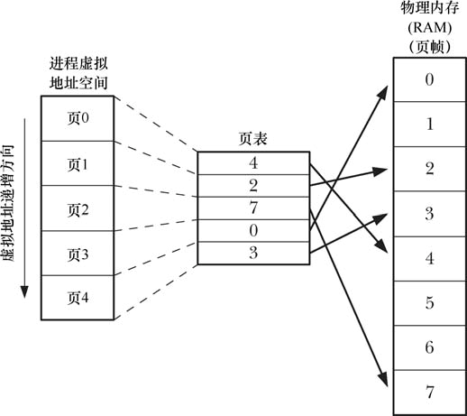
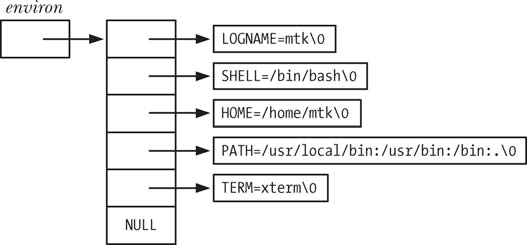
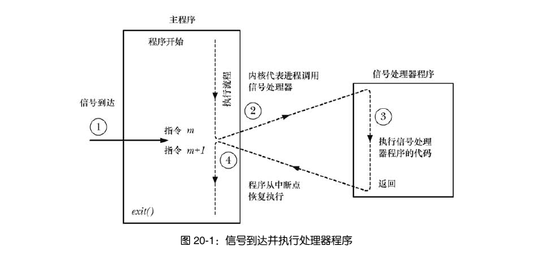
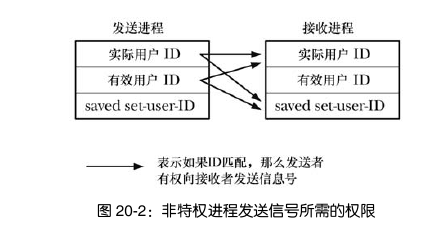

# 集合

# 第6章 进程

### 6.1 进程和程序

进程是正在运行的程序，多个进程可以由同一个程序创建而来

程序包含了 能描述如何在运行时创建一个进程 的信息

其中内容包括：

- 二进制格式标识：自身文件格式的元信息，内核用它来解读程序中的其他内容。
- 数据：程序文件中包含的变量初始值以及程序使用的字面常量的值
- 程序入口地址：标识程序开始执行的起始指令位置
- 要链接的东西：程序运行时需要使用的共享库


从内核的角度来看，进程是用来分配资源的一个抽象的实体。进程由用户内存空间以及一系列内核数据结构组成。用户内存空间包含了用户设计的程序代码以及在程序中设定的变量值；内核的数据结构则用于维护进程状态信息，比如虚拟内存表、打开的文件描述表、与进程相关的标识号。


### 6.2 进程号与父进程号

每个进程都有一个独一无二的进程号，它是一个正数。

Linux有一个最大进程号，如果超过了进程号计数器将重置，从较小整数开始分配（这个“较小”的比较大，比如300这样不是从0开始）。这个最大进程号可以更改（/proc/sys/kernal/pid_max)。

```c
#include <unistd.h>
pid_t getpid(void)   //返回自身的进程号
```

```c
#include <unistd.h>
pid getppid(void)    //返回父进程的进程号
```

Linux系统特有的/proc/PID/status文件提供的PPid字段，可以获知所有进程的父进程


### 6.3 进程内存布局

进程中包含不同的段

- 文本段：程序运行时的机器代码语言指令，为了防止意外篡改，所以具有只读属性。同时为了给多个程序共享，可映射到多个进程中的虚拟内存。
- 初始化数据段（用户初始化数据段）：包含被初始化的全局变量和静态变量
- 未初始化数据段（零初始化数据段）：又被叫做BSS段。包含未被初始化的全局变量和静态变量。程序在磁盘中存储时不用为它分配空间，只需要记录这些变量的位置及大小，因为它们会在程序启动之前被系统自动分配为0。
- 栈：由栈帧组成，系统会给每一个调用的函数分配一个栈帧。栈帧中有函数的局部变量、实参和返回值
- 堆：程序员自己动态分配，堆顶端称为 program break

函数更改初始化数据段和未初始化数据段可能会出现问题，这涉及到函数的可重入问题。




上图中灰色的部分没有分配页表，这些范围在进程虚拟地址空间中不可用。


### 6.4 虚拟内存管理

将每个程序使用的内存切割成小型的、固定大小的页。相应地，RAM被划分为尺寸相同的页帧。

每个进程都会有自己的页表，并由内核维护管理，通过页表把虚拟内存转化为对应的物理内存

对于一个正在运行的程序来说，不是所有虚拟地址在物理内存中都有对应的页。

部分驻留在物理内存页帧的页被称为驻留集





虚拟内存的实现依赖于访问局部性

**访问局部性**

1. 时间局部性：倾向于运行刚刚运行的指令（比如循环中一段代码循环执行）
2. 空间局部性：倾向于访问刚刚访问的内存附近的内存（比如顺序访问数组或其他的数据结构）

由于访问局部性，所以即使只有部分页存在于驻留集中，下次访问依然有可能成功。


如果内存想要访问的虚拟内存通过页表映射的实际物理地址不存在，那么就会发生页面错误（Page Fault）

[图解|什么是缺页错误Page Fault - 简书 (jianshu.com)](https://www.jianshu.com/p/c7b4ea025d4c)

**虚拟内存的好处**

- 不同的进程、进程与内核相互隔离
- RAM中可以同时容纳的进程增多
- 程序员在编程时不用关注程序在RAM中的物理布局
- 便于实现内存保护机制，可以标记页表，对其权限进行设置（可读、可写），以此作为安全限制
- 多个程序共享同一内存（页表指向同一块物理内存）


### 6.5 栈和栈帧

本处讨论的是用户栈，与内核栈区分开来。内核栈是每个进程保留在内核内存中的内存区域，在执行系统调用时，在受保护的内存中执行内部的函数调用。

栈随着函数的调用和返回线性地增长和收缩。X86-32架构之上的Linux,栈驻留在内存的高端，并从上向下增长。

专用寄存器——栈指针会记录当前栈顶的位置，每次调用函数就在栈上新分配一帧；函数返回时，将分配的帧从栈上移去。

栈中包含

- 函数实参和局部变量
- 调用的链接信息：一些CPU寄存器，比如程序计数器：记录下一条机器指令。调用其他函数时，会在被调用函数的栈帧中保存这些寄存器的副本，以便返回后可以知道原来运行的位置。


### 6.6 命令行参数（argc，argv）

每个C语言函数都必须有程序的入口——main()。当执行程序时，命令行参数由shell解析后提供argc和argv给main()，如果其他函数需要就必须当参数传入或者设置一个全局变量指向argv数组。

每个argv都是以'\0'结尾的字符串，最后一个argv是NULL。

argv[0]代表了程序自己的名字，它有一个妙用：给一个可执行程序创建不同的链接（即名字不同），然后再让程序查看argv[0]，根据链接的名字执行不同的操作。

argv和environ数组驻留在在内存中一块连续的区域。此区域可存储的字节数有上限要求。


### 6.7 环境列表

每个进程都有一个被称为环境列表的字符串数组，通过Linux专有的/proc/PID/environ文件可以查看。

环境列表是环境变量的集合，环境变量的形式为 XX=XXX，就像argv数组一样，环境列表的最后一项指向NULL。环境列表中的环境变量的排序是无序的。

在子进程创建时，父进程将环境传递给它，这是一种有效的进程间的沟通方式。而在这之后，父子之间各自环境的变化都相互不可见，彼此井水不犯河水。





在C语言中，有两种办法可以获取环境变量：

1.使用全局变量`char **environ` ，在程序里加上`extern char **environ`将其引入。

2.也可以在main()函数里像argc，argv作为一个参数传入：`int main(int argc,char* argv[],char* envp[])`。不过这种方法不在SUSv3的规范之列，最好避免使用。

#### 得到环境

```c
#include <stdlib>
char* getenv(const char* name);  //Return pointer to(value)string,or NULL if no such variable
```

*注意事项*

- getenv返回的字符串可能放置在静态分配的缓冲区，后续对getenv()、setenv()、putenv()或者unsetenv()的调用所以可能改写这块地方。为了以防万一，最好在调用setenv和putenv前，先把得到的字符串复制到一块自己准备的其他位置。
- SUSv3规定应用程序此函数返回的字符串，因为它是环境变量的一部分（name=value中的value）。要改环境变量就用专业的setenv和putenv。

#### 修改环境

```c
#include <stdlib.h>
int putenv(char* string);   //Returns 0 on success,or nonzero on error
```

参数string指向 name=value 形式的字符串。

putenv将会把环境列表中的一个指针指向与参数string所指向位置一致的地方，这意味着后续对参数string所指向的内容的修改会改变环境。出于这一原因，不应把string参数设定为自动变量。

```c
#include <stdlib.h>
int setenv(const char* name,const char* value,int overwrite);  //Returns 0 on success ,or -1 or error
```

要注意使用这个函数时不用加 ‘=’ (事实上，是绝对不要)。

这个函数会自己分配一块内存缓冲区，然后将name和value复制到那里，以此来创建一个新的环境变量。这意味着如果后续改变name和value所指的字符串，对环境不会有任何影响。

如果要添加的环境变量原来就有，那么，如果overwrite=0，就不会覆盖；如果overwrite=1，就会覆盖原来的环境变量。


unsetenv()函数从环境中移除一个指定name的环境变量

```c
#include <stdlib.h>
int unsetenv(const char* name)  //Returns 0 on success,or -1 on error
```

这个函数跟setenv()一样，参数中也不用画蛇添足地去加一个 '='。

如果要清空自身环境，可以通过environ变量获得所有环境变量的名称，然后逐一调用unsetenv()去移除每一个环境变量。


### 6.8 执行非局部跳转：setjmp() 和 longjmp()

```c
#include <setjmp.h>
int setjmp(jmp_buf env);  //Returns 0 on initial call,nonzero on return via longjmp()

void longjmp(jmp_buf env,int val);
```

setjmp为longjmp调用执行的跳转确立了跳转目标，即程序发起setjmp()调用的位置。第二次调用longjmp看上去跟第一次setjmp没什么两样，只不过setjmp()返回的值从 0 更改为了longjmp()指定的 val。

setjmp()把当前进程环境的各种信息保存到env参数中，这些信息包括但不限于程序计数寄存器和栈指针寄存器的副本。env常常作为全局变量，有时也当做函数入参传递，但这种用法很少见。

事实上，longjmp执行的是伪跳转，它的实现基于以下两点：

1. 剥离发起longjmp()调用的函数和setjmp()之间的所有栈帧（解开栈）。通过将栈指针寄存器重置为env参数内的保存值来实现。
2. 重置env中的程序计数器，回到原来的位置继续执行。

*用法实例*

```c
static void f1(void)
{
    longjmp(env,1);
}

switch(setjmp(env)){
    case 0:
        printf("initial setjmp()");
        f1();
        break;
    case 1:
        printf("jumped back from f1()");
        break;
}
```

# 第20章 信号：基本概念

### 20.1 概念和概述

发往进程的诸多信号，通常都是源于内核。信号分为两大类，一类是传统或者标准信号，另一类由实时信号组成。每个信号都对应定义了一个**唯一**的（小）整数，从1开始顺序展开。

信号产生后等待，什么时候到达不知道。一般来说，内核如果接下来要调度该进程，往往会立刻送达等待信号。

*引发内核进程产生信号的原因如下：*

1. 键入可以产生信号的终端特殊字符。
2. 发生了软件事件，例如调整了终端窗口大小。
3. 硬件检测到一个错误条件并通知内核：比如除以0，或者引用了无法访问的内存区域。

*进程收到信号后，可能导致如下结果：*

- 信号被忽略
- 终止（杀死）进程，常是异常终止
- 产生核心转储文件，同时进程终止
- 进程暂停
- 恢复暂停的进程

*信号到达时的响应行为可有：*

1. 采取默认设置
2. 忽略信号
3. 把信号交给信号处理器（一个函数），让它去处理

可以看到，无法将信号处置设置为终止进程或者转储核心。但是，你可以在其中调用exit()或者abort()，达成类似的效果。


### 20.2 常见信号

介绍了一些常见的信号

- SIGBUS  总线错误，发生了某种内存访问错误。
- SIGINT   用户手动键入终端终止字符时，由终端驱动程序发送该信号给前台进程组。该信号默认使进程终止。
- SIGKILL  用来终止进程，此信号无法被信号处理程序捕获、阻塞或忽略，所以“一击必杀”。
- SIGABRT 当进程调用abort()函数时，系统向进程发送该信号。终止进程并产生核心转储文件，核心转储文件可以用于调试。
- SIGCHLD 当子进程终止的时候（内核）向父进程发送。如果子进程停止或者恢复也可能产生该信号。
- SIGSEGV 当应用程序对内存的引用无效时产生。可能是不存在（堆与栈之间的未映射区域），也可能是不被允许读（只读、用户态访问内核内存）。


### 20.3 信号处理器函数原型

信号处理器函数指针：

```c
typedef void (*sighandler_t)(int);
```

有两个值可以代替它：

**SIG_DFL**

​	将信号重置为默认值。

**SIG_IGN**

​	忽略该信号。如果信号专为此进程而生，那么内核会默默将其丢弃。进程甚至从未知道曾经产生了该信号。


### 20.4 信号处理器简介

信号处理器程序是当指定信号传递给进程时将会调用的一个程序。

相关工作序列：



内核在调用信息处理程序时，会将一个整型数据传递给信号处理程序。这在对多个信号设置同一个信息处理器的时候很有用，因为这样信号处理器就可以知道到底接收了哪个信号并执行相应的操作。


### 20.5 发送信号：kill()

```c
#include <signal.h>
int kill(pid_t pid,int sig);  //Return 0 on success,or -1 on error
```

参数pid有以下情况

- 大于0的整数：发送给相应 pid 的进程
- 等于0：包括自己在内的同组所有进程
- 小于-1：pid为所输入的参数的绝对值的进程的所有下属进程
- 等于-1：相当于一个广播，发送给所有除自己和 init 进程以外的所有进程。

**发送信号需要适当的权限：**

1. 特权级进程 可以给任意进程发送信号。
2. init 进程是特例，它仅能接收已经安装了信号处理器的信号。
3. 如果发送进程的实际用户ID或者有效用户ID 与 接收进程的实际用户ID或保存设置用户ID(saved set-user-ID)相匹配，非特权级进程也可以发送信号。




如果进程无权发送信号所请求的pid,那么kill()调用将失败，且将errno置为EPERM


### 20.6 检查进程的存在

如果kill中sig参数设置为0（即空信号），kill将不会发送信号而是进行错误检查，查看是否可以向目标进程发送信号。我们可以以此检查目标进程是否存在。

errno为ESRCH，那么目标进程不存在，如果为EPERM（没有权限）或者发送成功就说明进程存在。

不过要注意的是，进程的 pid 存在不一定说明特定程序仍在运行。因为随着进程的生灭，内核会不断地利用已经使用过的进程号。

*还有其他技术检查某一特定进程是否正在运行*

- wait()。仅用于监控调用者的子进程


### 20.7 发送信号的其他方式：raise()和killpg()

向自己发信号：

```c
#include <signal.h>
int raise(int sig);  //Returns 0 on success,or nonzero on error
```

等价于`kill(getpid(),sig)`

调用之后，信号将立刻被传递给自己。唯一可能发送的错误是信号无效（EINVAL）。

向同组所有成员发信号：

```c
#include <signal.h>
int killpg(pid_t pgrp,int sig);  //Returns 0 on success,or -1 on error
```

等价于`kill(-pgrp,sig)`


### 20.8 显示信号描述

```c
#define _GNU_SOURCE
#include <string.h>

char *strsignal(int sig);  //Returns pointer to signal description string
```

返回针对信号的可打印字符串，或是当信号编号无效时指向错误字符串。SUSv3并未将其列入标准。


### 20.9 信号集

多个信号的集合，系统数据类型为 sigset_t

```c
#include <signal.h>
int sigemptyset(sigset_t* set);
int sigfillset(sigset_t* set);   //Both return 0 on success,or -1 on error
```

sigemptyset将信号集置空，sigfillset将信号集用所有的信号（包括实时信号）填满。

必须使用这两个函数来初始化，用0初始化可能会导致移植性上的问题，因为不是所有的系统都是通过位掩码实现信号集的。

在信号集中添加或者删除元素：

```c
#include <signal.h>
int sigaddset(sigset_t* set,int sig);
int sigdelset(sigset_t* set,int sig);  //Both return 0 on success,or -1 on error
```

测试某个元素是否为信号集的成员

```c
#include <signal.h>
int sigismember(const sigset_t *set,int sig)  //Returns 1 if sig is a member of set,otherwise 0
```

GNU库还实现了3个非标准函数，表示信号集的交集、并集，还有检验信号集是否为空。

```c
#define _GNU_SOURCE
#include <signal.h>

int sigandset(sigset_t* set,sigset_t* left,sigset_t* right);
int sigorset(sigset_t* set,sigset_t* left,sigset_t* right);  //Both return 0 on success,or -1 on error

int sigisempty(const sigset_t* set);  //Returns if sig is empty,otherwise 0
```


### 20.10 信号掩码（阻塞信号传递）

sigpromask可以显式地添加要阻塞的信号掩码、获取改动之前的信号掩码。

```c
#include <signal.h>
int sigpromask(int how,const sigset_t* set,sigset_t *old_set);  //Returns 0 on success,or -1 on error
```

**how:**

SIG_BLOCK

​	将新的信号掩码与原来的信号掩码取并集。

SIG_UNBLOCK

​	取消原来的信号掩码中set所指向信号集的信号。

SIG_SETMASK

​	将set所指的信号集设置为信号掩码。

如果不想改变，只想知道原来的设置是什么，可以把set设置为NULL。如果不在意以前的信号掩码设置，可以把old_set设置为NULL。

下面是一个示例：

```c
sigset_t blockset,preMask;

//制造信号集，添加了SIGINT
sigemptyset(&blockSet);
sigaddset(&blockSet,SIGINT);
//信号掩码添加信号
sigpromask(SIG_BLOCK,&blockSet,&preMask);
//信号掩码移除信号
sigpromask(SIG_SETMASK,&preMask,NULL);

```


### 20.11 处于等待状态的信号

如果进程在阻塞某信号时接收到了该信号，信号会被添加到进程的等待信号集中。解除锁定后，这些等待中的信号会被传递。 

如何知道哪些信号正处于等待状态？

```c
#include <signal.h>
int sigpending(sigset_t *set);	//Returns 0 on success,or -1 on error
```

sigpending将set所指向的信号集改为处于等待中的信号组成的集合。

ps:如果把等待信号的处置改为SIG_IGN或者SIG_DFL（如果信号的默认处置是忽略），信号将从进程的等待信号集中移除，这样这些信号后续就不会被传递了。


### 20.12 不对信号进行排队处理

等待信号集是一个掩码，所以只能记录某个信号有无发生，而不能记录信号发生的次数。

如果在阻塞信号期间，接收了同一个被阻塞的信号多次，那么只会记录一次。

要注意的是，如果发送方快速多次发送信号，如:

```c
for (int j=0;j<numsSigs;j++)
    kill(pid,sig);
```

即使信号没被阻塞，接收方极有可能收到的信号比实际传送的要少得多。因为在内核把执行权交给接收程序之前，第一个信号就已经到达，然后这段时间内到达的后续信号将处于等待状态。


### 20.13 改变信号处置：sigaction()

```c
#include <signal.h>
int sigaction(int sig,const struct sigaction *act,struct sigaciton *oldact);
	//Returns 0 on success,or -1 on error
```

如果对以前的信号处置不感兴趣，就把oldact指定为NULL

结构体sigaction的部分重要内容：

```c
struct sigaction{
    void (*sa_handler)(int); /*Address of handler*/
    sigset_t sa_mask;	/*Signals blocked during handler invocation*/
    int sa_flags;	/*Flags controlling handler invocation*/
    void (*sa_restorer)(void)	/*Not for application use*/
}
```

sa_handler是指向信号处理器的指针，可以用常量SIG_IGN或SIG_DFL代替。只有当sa_handler是信号处理器的地址时（即不是那两个常量的时候），后面的sa_mask和sa_flags才会派上用场。

sa_mask中的信号将在调用信号处理函数时被迅速添加到进程掩码中，并且在退出信号处理器时被删除。引发信号处理器的信号会自动添加至进程掩码，以防信号处理器递归中断自己。

sa_flags是一个位掩码，指定用于控制信号处理的各种选项。该字段包括的位如下：

- SA_NOCLDWAIT 若 sig 为SIGCHLD信号，则子进程终止时不会将其转化为僵尸。
- SA_ONSTACK 针对此信号调用处理器函数时，使用了由sigaltstack安装的备选栈。
- SA_NODEFER 捕获该信号后，不会在执行处理器程序时将其自动添加到掩码之中


### 20.14 等待信号：pause()

pause()函数会使进程停止，直到接收到一个信号并执行信号处理器。

```c
#include <signal.h>
int pause(void);	//Always returns -1 with errno set to EINTR
```

pause一旦被中断，会返回-1,并将errno置为EINTR。


# 第21章 信号：信号处理器函数

### 21.1 设计信号处理器函数

信号处理器一般越简单越好，这样可以减少竞争条件发生的概率。

有两种常用的设计：

1. 信号处理器函数设置全局性标志变量并退出，由主函数周期性检查其是否置位，若置位则采取相应的操作。
2. 信号处理函数执行某种清理操作，然后终止进程或者使用非本地跳转将栈解开，跳转到主程序中的预定方位。

#### 21.1.1 再论信号的非队列化处理

上一章提到的信号“失踪”（多次信号只标记为一次），无疑会影响对信号处理器函数的设计。首先，无法对信号的产生次数进行可靠的计数。其次，在设计信号处理器时要特别注意同一信号多次传递的情况。

#### 21.1.2 可重入函数和异步信号安全函数

##### 可重入和非可重入函数

设计信号处理器时要特别注意可重入问题，尽量不要使用不可重入的函数。可重入意味着“安全”，即无论其他线程是否在同时使用该函数都能返回正确的结果。

可能不可重入的函数的 行为特征：

- 使用静态分配的内存
- 修改一个全局变量或静态数据结构

*<u>举个栗子（修改静态数据结构）</u>*

信号的送达是异步的，在收到信号执行信号处理函数时，一条线程中实际产生了两个执行线程。这两个执行线程可能同时对一个对象进行操作。这可能会出问题，比如说某线程正在为一链表数据结构添加一个新的链表项，另一线程也试图更新同一链表。由于为链表添加新项涉及多个指针的更新，一旦另一线程中断这些步骤并修改了相同的指针，结果就会发生混乱。

<u>*再举个栗子（使用静态分配的内存）：*</u>

crypt()使用静态分配的内存。如果在主程序运行过程中如果同时运行信号处理器，那么可能会将这块内存污染。

我们把argv[1]经过加密后得到的密文作为cr1。

str2作为污染源。

```c
cr1 = strdup(crypt(argv[1],"xx"));
str2 = argv[2];
```

这是用于污染的信号处理函数：

```c
static void handler(int sig)
{
    crypt(str2,"xx");
    handled++;
}
```

这是比较是否被污染的环节，如果被污染了，mismatch自增。我们会在这个环节不断发送信号，然后信号处理程序不断启用，污染crypt()上次正常使用时的静态分配的内存。

```c
while(1)
{
    if (strcmp(crypt(argv[1],"xx"),cr1) != 0)
        mismatch++;
}
```

运行的结果：

mismatch自增了好几次，说明在大多数情况下，处理器函数会在main()中的crypt()调用与字符串比较之间去覆盖静态分配的缓冲区。


ps:以为信号处理器中不调用不可重入函数就行了吗？太天真了，你还得注意程序本身是否有类似于修改全局变量的行为。

##### 标准的异步信号安全函数

不安全的定义是：信号处理函数打断不安全函数的运行，并且自身运行与被打断的函数相关的不安全函数。

所以保证信号安全有两种方式：

1. 信号处理函数本身可重入
2. 在有不安全隐患（如修改全局变量）的程序中阻塞相关信号的传递

注意，如果sigaction()设置了SA_NODEFER，意味着信号处理器可以递归中断自己。这样，如果处理器函数更新了全局变量，即使原程序不使用此全局变量，信号处理函数仍然可能是不安全的。因为它可能会自己影响自己修改全局变量的过程。

##### 信号处理器函数内部对 errno 的使用

主程序要使用 errno 的过程中可能被信号处理器函数打断。errno是全局变量，所以在如果信号处理函数中也更新errno就可能导致一些可重入问题。

这个问题可以通过在信号处理器开头保存errno,然后在信号处理器完成任务后再次恢复来解决

```c
void handler(int sig)
{
    int savedErrno;
    savedErrno = errno;
    /* doing something */
    errno = savedErrno;
}
```

#### 21.1.3 全局变量和sig_atomic_t 数据类型

有一种信号处理器的方式是：在信号处理函数中改变某全局变量，然后在主函数对此进行检查（反之亦可）。

要防止相互干扰

1.为了防止编译器优化，前面加volatile。

2.C++定义了一种整型数据类型sig_atomic_t，该类型意在保证对该变量的读写操作都是原子操作。注意递增(++)和递减(--)不在 sig_atomic_t 所提供的保障范围之内。

***最后声明如下：***

```c
volatile sig_atomic_t flag;
```

sig_atomic_t范围在 SIG_ATOMIC_MIN 与 SIG_ATOMIC_MAX 之间。


### 21.2 终止信号处理函数的其他方法

如果信号处理器只会以返回主程序而终结，那就太无趣了。

信号处理函数还有以下的方式退出。

- _exit()终止进程。注意不要用exit,因为它会刷新stdio的缓冲，引发可重入问题
- kill()杀死自己所在的进程
- 执行非本地跳转，跳转到以前的位置
- abort()终止进程，并产生核心转储文件

接下来将对最后两点进行较为详尽的说明。

#### 21.2.1 在信号处理器中执行非本地跳转

sigsetjmp() 和 siglongjmp() 跟之前的 setjmp()与longjmp()很像。

之前的longjmp()在从信号处理器函数中退出时存在一个问题：

众所周知，在进入信号处理器时，内核会自动将 act.sa_mask 中的信号掩码添加进程掩码，然后在信号处理器结束的时候将这串信号从进程掩码中删除。那么问题来了，在执行信号处理器时非本地跳转到原来位置，那么信号掩码是恢复成未添加的还是保持添加的不变？

对此，两大 Unix 实现 阵营发生了分歧：System V 不恢复（Linux遵循这一特性）；BSD 恢复到未添加掩码的时候。因此，使用这对函数会造成程序可移植性上面的一些问题。

POSIX 既然如此，你们也不要吵了，我来给你们制定俩新函数标准——sigsetjmp()和siglongjmp()。

```c
#include <setjmp.h>
int sigsetjmp(sigjmp_buf env,int savesigs);  // Returns 0 on initial call,nonzero on return via siglongjmp()
void siglongjmp(sigjmp_buf env,int val);
```

这里的sigsetjmp()多了一个savesigs表示要不要把信号掩码恢复成调用信号处理器前的状态。0代表不恢复，1代表恢复。

longjmp 和 siglongjmp 都是不可重入函数。有可能在执行主函数修改某数据结构正修改了一半的时候，突然来了一个信号，然后调用信号处理器实行非本地跳转，结果该数据结构半途而废了。为了防止这种情况的发生，可以在修改敏感数据时阻塞相关信号的传输。

如果在 setjmp 前就 jmp ，意味着使用未经初始化的 env ，这是很危险的一件事。有一种防止在setjmp前就jmp的小技巧：设置一个守卫变量。只有在守卫变量亮了的时候才执行相关的操作。

*信号处理函数：只有在canJump的时候在jmp.*

```c
static void handler(int sig)
{
    if(!canJump){
        printf("'env' buffer not yet set,doing a simple return\n");
        return;
    }
    siglongjmp(senv,1);  
}
```

*主函数：*

```c
static sigjmp_buf senv;  //全局变量
int main(int argc,char* argv[])
{
    // 设置信号处理函数
    struct sigaction sa;
    sigemptyset(&sa.sa_mask);
    sa.sa_flags=0;
    sa.sa_handler=handler;
    sigaction(SIGINT,&sa,NULL);
    
    // 重点：只有当setjmp后把sigsetjmp()后才把canJump置为1
    if (sigsetjmp(senv,1) == 0)
        canJump = 1;
}
```

#### 21.2.2 异常终止进程:abort()

abort()通过发送信号 SIGABRT 来终止进程同时生成核心转储文件。下次编译器可以通过调试核心转储文件知道当时发生了什么事。

```c
#include <stdlib.h>
void abort(void);
```

abort()只有在信号处理函数没有返回的情况下才不会终止进程。信号处理函数可以非本地跳转，化解掉 abort() 危机。

如果信号处理函数返回后进程还没有终止，abort()会把针对 SIGABRT 的处理方式设置为SIG_DFL，以确保下次肯定能把进程给杀死。

如果 abort() 成功终止了进程，那么还将刷新 stdio 流并将其关闭。


### 21.3 在备选栈中处理信号: sigaltstack()

当进程对栈的扩展试图突破其上限时，内核将为该进程产生 SIGSEGV 信号。

但是这时由于栈已经满了，没有地方给信号处理器分配栈帧。

所以要在这之前提前给它分配一个备选栈。

```c
#include <signal.h>
int sigaltstack(const stack_t* sigstack,stack_t* old_sigstack);
```

*sigstack结构体：*

```c
typedef struct{
    void *ss_sp;
    int ss_flags;
    size_t ss_size;
}stack_t;
```

<u>ss_sp</u> :指向栈的起始位置，实际使用信号栈时，内核会将ss_sp值自动对齐为与硬件架构相适应的地址边界。

<u>ss_size</u> :表示栈的大小，规定常量 SIGSTKSZ 作为划分备选栈大小的典型值。

<u>ss_flags:</u>

SS_ONSTACK:

如果 old_sigstack 的ss_flags含此，那么就说明原来的备选栈正在被当前的进程使用。这时试图调用一个新的备选信号栈会产生一个错误(EPERM)。

SS_DISABLE:

在 old_sigstack 中返回，表示不存在已创建的备选信号栈。如果在 sigstack 中指定，会禁用当前已创建的备选信号栈。


# 第24章 进程的创建

### 24.1 fork()、exit()、wait()以及 execve()的简介

- fork()创建一个和原来几乎一模一样的子进程，获得和父进程相同的栈、数据段、堆和文本段的拷贝。
- exit(&status)终止进程，它在_exit()的上层。它把进程所占用的所有资源（内存、文件描述符等）归还内核，交其进行重新分配。参数status为一整型变量，表示进程的退出状态，可由父进程通过wait()获取。
- wait(&status)，等待子进程的终止，接收终止的子进程的状态。
- execve(pathname,argv,envp)，加载一个新程序（路径名pathname,参数列表argv,环境envp）。它会丢弃现存程序文本段，为新程序重新创建栈、堆、数据段，开始新程序。

*下面是一个相互协作的示例：*


### 24.2 创建新进程：fork()

fork()创建一个子进程，文本段完全相同，数据段、栈和堆则另外独立地复制一份。

```cpp
#include <unistd>
pid_t fork(void);   /*In parent:returns process ID of child on success,or -1 on error;
		 			  In successfully created child:always returns 0
```

创建失败的原因可能是达到了系统对此真实用户设置的上限(RLIMIT_NPROC)，也可能是突破了系统创建的最大进程数这一系统级上限。

fork()之后每个进程都会从fork()的返回处继续执行。注意，调用fork()之后，系统先垂青哪个进程是不确定的（当然你可以对其进行人为干扰，比如wait()一下）


#### 24.2.1 父子进程间的文件共享

子进程会拥有父进程所有文件描述符的副本。这意味着父、子进程的文件描述符均指向相同的文件描述句柄。

如果父/子进程改变了文件某些属性，那么这个改动在子/父进程通过相应的文件描述符也是可见的。

#### 24.2.2 fork() 的内存语义

在一些早期的UNIX实现中，fork()保持自身内存不变，老老实实地把内存复制一份到交换空间，然后再将之从交换空间载入内存作为子进程。

这样很浪费，因为fork()之后经常伴随 exit() ，这会用新程序替换进程的代码段。并且初始化堆、栈、数据段，等于刚刚白复制了一遍

现在采用两种技术避免这种浪费：

- 系统调用fork()为子进程创建代码段时，其所构建的页表指向与父进程相同的物理内存页帧。从而父子进程可以共享同一代码段。
- 对于父进程数据段、栈段和堆段中的各页，采用写时复制技术：fork()后，内核捕获父进程或子进程发出的更改这些页面的请求，为要修改的地方新创建一份拷贝，然后把该拷贝分配给遭到捕获的进程（就是刚刚在提要求的进程，遭捕获是说它的声音被内核听见了），还会对子进程的相应页表项做相应调整。


##### 控制进程的内存需求

进程可能会因为杂七杂八的事情，比如说调用函数、malloc()和free() 等等，改变对内存的需求。

利用这项技术，把任务分配给子进程处理，可以保证父进程的内存不变。

基于此：

- 若已知某个函数会内存泄露或堆过度碎片化，但我们无法访问它的源码，该技术可以避免这个问题。
- 做树形分析时，省去了free()


### 24.3 系统调用 vfork()

已过时，尽量不使用。

两个特性：

- 子进程共享父进程的内存
- 在子进程调用 exec() 或 _exit() 之前，将暂停执行父进程


### 24.4 fork() 之后的竞争条件

调用 fork() 后可，无法确定父、子进程间谁将率先访问 CPU（在多处理器系统中，它们可能会同时各自访问一个 CPU)。我们不应对fork() 之后父、子进程的特定顺序做任何假设。

若确需保证某一特定执行顺序，则必须采用某种同步技术。


# 第25章 进程的终止

## 25.1进程的终止

通常,进程有两种终止方式。

其一为异常(abnormal)终止,由对一信号的接收而引发,该信号的默认动作为终止当前进程,可能产生核心转储(core dump) 。

此外,进程可使用\_exit()系统调用正常(normally)终止。

```c
#include <unistd.h>
void _exit(status);
```

\_exit()的 status 参数定义了进程的终止状态(termination status),父进程可调用 wait()
以获取该状态。虽然将其定义为 int 类型,但仅有低 8 位可为父进程所用。
调用\_exit()的程序总会成功终止(即,\_exit()从不返回)。


程序一般不会直接调用\_exit(),而是调用库函数 exit(),它会在调用_exit()前执行各种动作。 

```c
#include <stdlib.h>
void exit(int status);
```

exit()会执行的动作如下。

- 调用退出处理程序(通过 atexit()和 on_exit()注册的函数),其执行顺序与注册顺序相反(见 25.3 节)。
- 刷新 stdio 流缓冲区。
- 使用由 status 提供的值执行_exit()系统调用。


程序的另一种终止方法是从 main()函数中返回(return),执行 return n 等同于执行对 exit(n)的调用,因为调用 main()的运行时函数会将 main()的返回值作为 exit()的参数。


## 25.2 进程终止的细节

无论进程是否正常终止，都会发生以下的动作：

- 释放资源，如文件描述符、目录流
- 如果该进程是一个管理终端的进程，将会向终端前台的进程组中的每个进程发送 SIGHUP 信号，并脱离与终端的会话。


## 25.3 退出处理程序

若某一进程中使用了一个应用程序库，那么在进程终止前该库需要自动执行一些清理工作。这个时候就要用到退出处理程序，它可以在程序中的任何一段注册，调用exit()正常终止时会自动执行，直接调用_exit()或者收到信号异常终止时不会。

> 可以为信号设置信号处理器，在其中设置标志位，然后主程序据此调用exit()（exit()非线程安全函数，所以不可在信号处理器中调用）。
>
> SIGKILL总是采用默认设置，这也是尽量要少用它的原因。建议使用SIGTERM

#### 注册退出处理程序

```c
#include <stdlib.h>
int atexit(void(*func)(void))  //Returns 0 on success,or nonzero on error
```

该函数将func加入到函数列表里去，进程终止时会调用该函数列表。

你可以注册多个退出处理程序，甚至多次向函数列表里添加同一函数。在执行函数列表时，执行顺序与注册顺序相反。这很符合逻辑，因为先注册的往往执行的是更基本的清理工作，要放到最后进行。

如果有任一退出处理程序无法返回（调用了_exit或收到信号异常终止），那么就不会再调用剩余的处理程序。

通过fork() 创建的子进程会继承父进程注册的退出处理函数。而进程调用exec()时，会移除所有已注册的退出处理程序。

atexit()有两个局限性：

其一，退出处理程序在执行时无法获知传递给exit()的状态

其二，无法指定参数，这样退出处理程序就无法根据参数执行不同的动作

为摆脱这些限制，glibc提供了一个（非标准的）替代方法：

```c
#define _BSD_SOURCE
#include <stdlib.h>
int on_exit(void(*func)(int,void*),void*arg);   //Returns 0 on success,or nonzero on error
```

func指向如下类型的函数：

```c
void func(int status,void* arg)
{
    /*Perform cleanup actions*/
}
```

其中status是调用给exit()的参数，会自动给func，不必担心。


## 25.4 fork()、stdio缓冲区以及_exit()之间的交互

代码：

```cpp
#include <iostream>
#include <unistd.h>
#include "myerror.h"

int main(int argc,char* argv[])
{
    std::cout <<"cout hello world " <<std::endl;
    printf("printf hello world\n");
    write(STDOUT_FILENO,"Ciao\n",5);

    if (fork()==-1){
        myerr("fork");
    }

    exit(EXIT_SUCCESS);
}

```

演示：

```
[username@piu something]$ ./fork_and_buffer
cout hello world
printf hello world
Ciao
[username@piu something]$ ./fork_and_buffer > a
[username@piu something]$ cat a
cout hello world
Ciao
printf hello world
printf hello world
```

这里把输出重定向到 a 之后，重新打印了两遍 printf hello world ，这是为什么呢？

*第一次未重定向时：*

printf()默认是行缓冲，立即打印出来了。

*第二次重定向后：*

printf()默认为块缓冲，缓冲区是维护在进程的用户空间内存中的。fork()时，父进程字符串仍存在缓冲区中内，且该缓冲区被子进程同样地复制了一份。在exit(EXIT_SUCCESS)后，父子进程刷新各自的缓冲区，于是两个进程中缓冲区的内容都被输出了出来。

**可以用以下任一方法来避免重复的输出结果：**

- 作为针对 stdio 缓冲区问题的特定解决方案,可以在调用 fork()之前使用函数 fflush()来刷新 stdio 缓冲区。

  作为另一种选择,也可以使用 setvbuf()和 setbuf()来关闭 stdio 流的缓冲功能。

- 子进程调用_exit()退出而非 exit()


ps: write() 的输出并未出现两次，是因为write()会将数据直接传给内核缓冲区，fork()不会复制这一缓冲区。为什么write()的结果会先于fork()的原因也找到了，因为write()会将数据立即传给内核高速缓冲，而 printf() 的输出则需要等到 exit() 刷新 stdio 缓冲区时。


